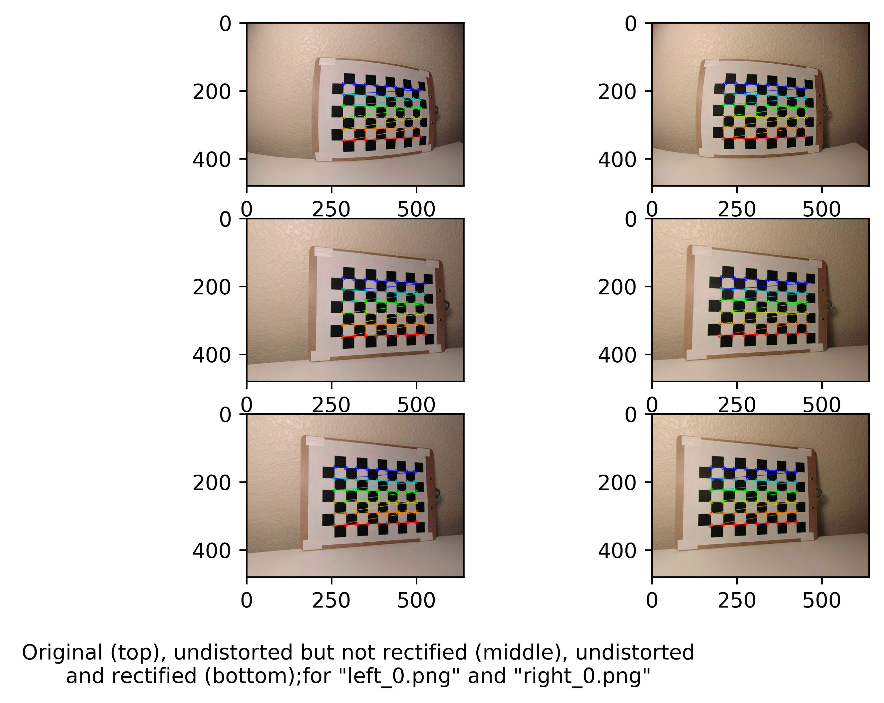

# Camera_model
The project involves- 
1. [Stereo depth sensing](#1-stereo-depth-sensing) which is done in 4 steps-
   - Camera calibration by finding its intrinsic parameters.
   - Stereo calibration by calculating rotation and translation matrices between the two cameras in the stereo system. Stereo rectification by rotating the two views from the two cameras.
   - Sparse depth sensing by using epipolar geometry on pairs of feature points in the two views to triangulate the 3D points corresponding to those pairs. 
   - Dense depth sensing by calculating a disparity map of each pixel using the two views to obtain the depth of all pixels.
2. [Camera motion and structure](#2-camera-motion-and-structure) by calculating- 
   - homography to reconstruct the world plane from an image.
   - camera pose from a single view as a PnP problem.
   - camera pose from two views using essential matrix.

## 1. Stereo depth sensing

Depth sensing involves calculating the position of the 3D points in the world plane from 2D points in the image plane. This is done using two views of the same scene taken at the same time from two cameras which are part of a stereo system. The depth of only some of the matching pixels between the two views can be estimated using Sparse depth sensing. When the depth of all the pixels in the two views is estimated it is called dense depth estimation.   

The code for each step is written as a separate task from task1-task4 in the folder named 'code'.
### Task 1- Camera calibration

Camera calibration is used to find the intrinsic parameters i.e. f_x & f_y which are focal lengths of the camera and c_x & c_y which are optical centers of the camera. This is done for both the two cameras in the stereo system. The output of the task is a camera matrix with all the four parameter values (f_x, f_y, c_x and c_y) for each camera stored as .csv files- left_camera_intrinsics.csv and right_camera_intrinsics.csv in the 'parameters' folder.

This task is perfromed on images (two views) of chessboard patterns taken at different orientations from the stereo camera system. To check the calibration results, the image of each view is undistorted using their respective intrinsic camera matrix calculated. These resulting images are in the 'output' folder for 'task_1'-

  

  

### Task 2- Stereo Calibration and rectification

Stereo calibration involves the task of calculating the rotation and translation (using the intrinsic parameters calculated in the previous task) between the two camera reference frames of the stereo system. 
The output of the calibration process- rotation, translation, fundamental and essential matrices are stored in the same .csv file- stereo_calibration.csv in the 'parameters' folder. 

Using the rotation and translation matrices, we calculate R1, R2, P1 and P2 which are rotation and pose matrices from unectified pose to rectified pose of the two cameras. These matrices are necessary for rectifying the two cameras. 
R1, R2, P1 and P2 are stored in the .csv file- stereo_rectification.csv. After rectifying two views in the stereo system using rectification parmaters calculated, we get the two views whose principal axes are parallel and the pixels in row correspondences.
This can be seen in the images in the 'output' folder for 'task_2'-

  

### Task 3- Sparse depth sensing

Using the parameters calculated in task 1 and task 2, sparse 3D coordinates from the two views of the stereo system are obtained. First, features in two views are detected using OpenCV 'orb' class and then local non-maximum supression is performed
to reduce the number of detected features. 

  

The reduced features are matched between the two views using 'BFMatcher' class. 

  

Finally, we calculate the 3D coordinates by triangulating the matched features. 

  

### Task 4- Dense depth sensing

To calculate the depth of every pixel, dense depth triangulation is performed using the parameters calculated in the first two tasks. 'StereoBM' class is used to calculate disparity map 
in which the depth of a point in a scene is inversely proportional to the difference in distance of corresponding image points and their camera centers in the two views.

  

## 2. Camera motion and structure