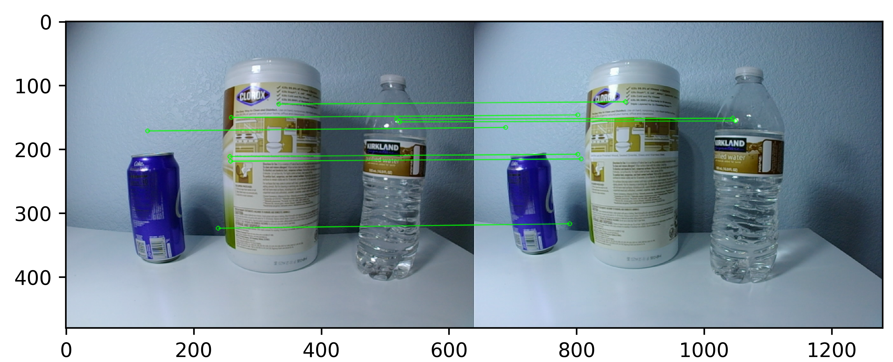
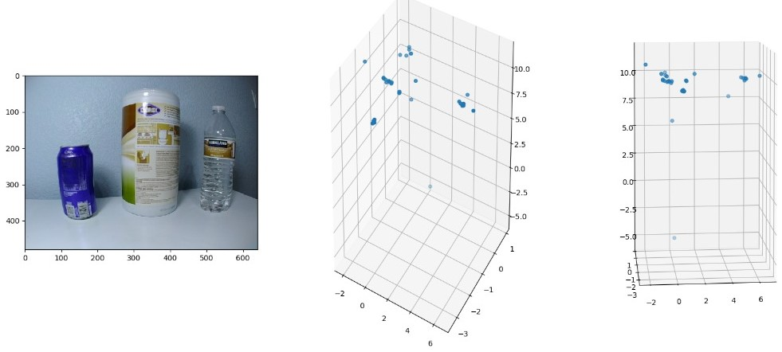
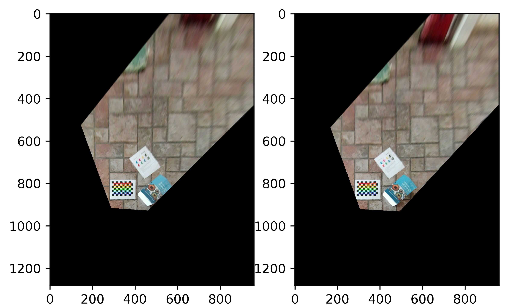

# Camera_model
The project involves- 
1. [Stereo depth sensing](#1-stereo-depth-sensing) which is done in 4 steps-
   - Camera calibration by finding its intrinsic parameters.
   - Stereo calibration by calculating rotation and translation matrices between the two cameras in the stereo system. Stereo rectification by rotating the two views from the two cameras.
   - Sparse depth sensing by using epipolar geometry on pairs of feature points in the two views to triangulate the 3D points corresponding to those pairs. 
   - Dense depth sensing by calculating a disparity map of each pixel using the two views to obtain the depth of all pixels.
2. [Camera motion and structure](#2-camera-motion-and-structure) by calculating- 
   - homography to reconstruct the world plane from an image.
   - camera pose from a single view as a PnP problem.
   - camera pose from two views using essential matrix.

## 1. Stereo depth sensing

Depth sensing involves calculating the position of the 3D points in the world plane from 2D points in the image plane. This is done using two views of the same scene taken at the same time from two cameras which are part of a stereo system. The depth of only some of the matching pixels between the two views can be estimated using Sparse depth sensing. When the depth of all the pixels in the two views is estimated it is called dense depth estimation.   

The code for each step is written as a separate task from task1-task4 in the folder named 'code'.
### Task 1- Camera calibration

Camera calibration is used to find the intrinsic parameters i.e. f_x & f_y which are focal lengths of the camera and c_x & c_y which are optical centers of the camera. This is done for both the two cameras in the stereo system. The output of the task is a camera matrix with all the four parameter values (f_x, f_y, c_x and c_y) for each camera stored as .csv files- left_camera_intrinsics.csv and right_camera_intrinsics.csv in the 'parameters' folder.

This task is perfromed on images (two views) of chessboard patterns taken at different orientations from the stereo camera system. To check the calibration results, the image of each view is undistorted using their respective intrinsic camera matrix calculated. These resulting images are in the 'output' folder for 'task_1'-

  

  

### Task 2- Stereo Calibration and rectification

Stereo calibration involves the task of calculating the rotation and translation (using the intrinsic parameters calculated in the previous task) between the two camera reference frames of the stereo system. 
The output of the calibration process- rotation, translation, fundamental and essential matrices are stored in the same .csv file- stereo_calibration.csv in the 'parameters' folder. 

Using the rotation and translation matrices, we calculate R1, R2, P1 and P2 which are rotation and pose matrices from unectified pose to rectified pose of the two cameras. These matrices are necessary for rectifying the two cameras. 
R1, R2, P1 and P2 are stored in the .csv file- stereo_rectification.csv. After rectifying two views in the stereo system using rectification parmaters calculated, we get the two views whose principal axes are parallel and the pixels in row correspondences.
This can be seen in the images in the 'output' folder for 'task_2'-

  
  
 Original (top), undistorted but not rectified (middle), undistorted and rectified (bottom); for 'left_0.png' and 'right_0.png'

### Task 3- Sparse depth sensing

Using the parameters calculated in task 1 and task 2, sparse 3D coordinates from the two views of the stereo system are obtained. First, features in two views are detected using OpenCV 'orb' class and then local non-maximum supression is performed
to reduce the number of detected features. 

  
  
 Detected feature points (left) and selected local maxima feature points with a six pixel radius (right) 

The reduced features are matched between the two views using 'BFMatcher' class. 

  
  
Selected matches of feature points on the two views

Finally, we calculate the 3D coordinates by triangulating the matched features. 

  
  
Sparse depth triangulation results: the original image (left), obtained 3D points (middle), 3D points on a cylinder surface from a certain view (right).

### Task 4- Dense depth sensing

To calculate the depth of every pixel, dense depth triangulation is performed using the parameters calculated in the first two tasks. 'StereoBM' class is used to calculate disparity map 
in which the depth of a point in a scene is inversely proportional to the difference in distance of corresponding image points and their camera centers in the two views.

  

## 2. Camera motion and structure

Camera motion and structure involves recontruction of a scene using the images taken from the cameras in the stereo system and the parameters calculated in the previous tasks. The code for this section is from 'task_5.py'-'task_7.py' in the 'code' folder. 

### Task 5- Planar homography
Task 5 is reconstructing the 2D world plane from an image by finding homography matrix
for that image using the camera intrinsics found in 'task_1.py'. The 2D world plane images can be found in the 'output' folder for 'task_5'. 

  

### Task 6- Camera pose estimation from a single view

Using the images of a scene taken from a single camera, it is possible to localize the pose of the camera from atleast four known points in 3D as a PnP problem. The four points are found by detecting Aruco markers. 

  
  The pose of the camera in 11 views using "left_0.png" to "left_10.png.

### Task 7- Camera pose estimation and reconstruction from two views

Two view reconstruction is creating the 3D point cloud from two views taken by the same camera at two different poses. First, we match points between the two views to calculate the essential matrix.
This essential matrix is then used to recover the pose of the camera. 

  
  An illustration of the recovered camera pose and reconstructed 3D points.

